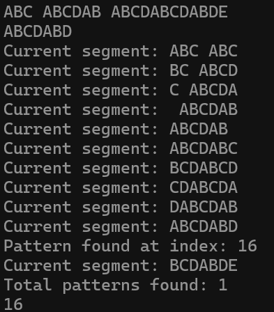

### 2024.03.06
### baekjoon 1786
# **Search the Pattern in Text**

## 1. Code
 ```c

 ```
***

## 2. output
**First case**   
   

**Second case**   

***

## 3. Approach
### Pseudo code
```c
Function search_ptn(char* T, char* P, int len_T, int len_P)
    next := 0
    cnt  := 0

    idx  := []
    str  := []

    for i = 0 to (len_T - len_P - 1)
        strncpy (str, T + i, len_P)
        { copy T[i] : T[i + len_P] to str }

        for j = len_P -1 to n

            if strchr((P, str[j]) == NULL) then
                i += j
                break

            if  P[j] == str[j] then
                next ++
                if next == len_P then
                    idx[cnt++] := i + 1

        next := 0
```

### Explanation for Psuedo code
How to approach
function search_ptn
1. Compare txt with ptn in range of `len(ptn)`, beginning at the right.
2. If there are new string in txt which is not in `ptn`,
3. Research after new string.
4. Repeat these process until find `ptn` in `txt`.

***

## 4. Analysis
### Correctness


### Performance
- Notation: $n=|T|,m=|P|$ where $T$ is a text  and $P$ is a pattern
- The total time complexity in worst case:
    - Line 1의 `for`-loop: $n-m$ 수행  
    - Line 5의 nested `for`-loop: $O(m)$ 수행 
    - More accurately, it's $(n-m)\cdot(2m+2) = 2mn - 2m^2 + 3n - 2m + 17$.
    - Thus, the total complexity is $O(nm)$.   

- `search_ptn(...)` 함수 Time complexity of worst case

    |   line     |  complexity |
    |:----|:----:|
    |23,24,26,27 |   1  |
    |29          | n-m |
    |31          |   1  |
    |33          |   m  |
    |35          | pass |
    |39~43       |   2  |
    |48          |   1  |
    |total : $4 + (n-m(1+m\cdot2+1)) = (2m+2)n - (2m+2)m = O(nm)$|
    | |

- The total time complexity in best case:
  - Line 1의 `for`-loop: $n/m$ 수행
  - Line 5의 nested `for`-loop: $O(m^2)$ 수행 
  - Thus, the total complexity is $n/m\cdot O(m^2)=O(nm)$ even in best case.   
***

## 5. Future Work
To increase the efficiency of search, it is necessary to find duplicate characters in the pattern.   
For this, you have to use the $kmp$ or $Booyre-Moore$ method after all.
