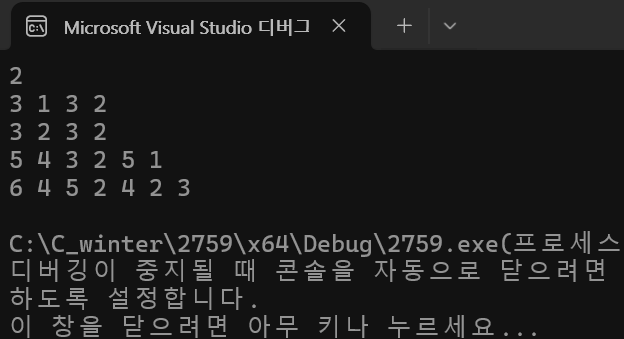
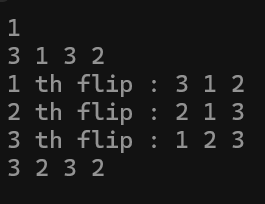

### 2024.03.01
### baekjoon 2759
# **Flip the Pancakes**

## 1. Code
 ```c
#define _CRT_SECURE_NO_WARNINGS
#include <stdio.h>
#include <stdint.h>
#include <stdlib.h>
#include <string.h>

//@brief		 find the largest value in the array whose size is 'num'
int 
max_idx(const int32_t* pancakes, const int32_t num) {
	int32_t idx = 0;
	for (int32_t i = 1; i < num; i++) {
		if (pancakes[i] >= pancakes[idx]) {
			idx = i;
		}
	}
	return idx;
}

//@brief		 flip the array whose size is 'num'
void
flip(int32_t* pancakes, const int32_t num)
{
	int32_t temp = 0;
	for (int32_t i = 0; i < num/2; i++) {
		temp = pancakes[i];
		pancakes[i] = pancakes[num - 1 - i];
		pancakes[num - 1 - i] = temp;
	}
	return;
}

//@brief		sort array to be ascending
void 
sort(int32_t* pancakes, int32_t num) {
	int32_t cnt = 0;
	int32_t idx[100];

	for(int i = num; i>1; i--){ 
		int32_t max = max_idx(pancakes, i);

		// not when max is at the bottom
		if (max != i-1) {
			// not when max is on the top
			if (max != 0) {
				flip(pancakes, max + 1);
				idx[cnt++] = max + 1;
			}

			flip(pancakes, i);
			idx[cnt++] = i;
		}
	}

	printf("%d ", cnt);
	for (int i = 0; i < cnt; i++) {
		printf("%d ", idx[i]);
	}
	printf("\n");

}

int main(void) {
	int32_t T = 0;
	scanf("%d", &T);

	while (T--) {
		int32_t num;
		scanf("%d", &num);

		int32_t* pancakes = calloc(num, sizeof(int32_t));
		memset(pancakes, 0, num * sizeof(int32_t));

		for (int32_t i = 0; i < num; i++) {
			scanf("%d", &pancakes[i]);
		}

		sort(pancakes, num);
	}

	return 0;
}
 ```

***

## 2. output


***

## 3. Approach
### Pseudo code
```pseudocode
function sort_pancakes
cnt := 0
idx := []
for i = n to 2
	max := find_ max(pancakes, i)
	if max != (i-1) then
		if max != 0 then
			flip(pancakes, max+1)
			idx[cnt++] := max+1
		flip(pancakes, i)
		idx[cnt++] := max+1
print cnt
print idx
```

```pseudocode
function find_max
idx := 0
for i = 1 to (n-1)
	if pancakes[i] >= pancakes[idx] then
		idx := i
return idx
```

```pseudocode
function flip
	temp := 0
	for i = 0 to (num/2)-1
		temp := pancakes[i]
		pancakes[i] := pancakes [num -1-i]
		pancakes[num-1-i] := temp
```

### Explanation for Psuedo code
**How to Approach**   
The user receives N integers. You need to output how many times you have to flip in order to sort these integers in ascending order.   
The main rule is to raise the maximum value to the top, then flip the entire array so that the maximum value is at the bottom.

To summarize the rules, first, if you find the maximum value in an array, flip the array including the maximum value. Second, if the maximum value is at the top of the array, flip the whole. Third, if the maximum value is at the end, nothing is done.

When looking at the process of finding the maximum value, the itator is reduced by 1 through the repetition statement. Therefore, the range of finding the maximum value varies every time you go around the repetition statement.

Also increase the cnt by 1 every time you flip it, save the index in the array and output where you flip it.

***

## 4. Analysis
### Correctness 
If you get '3 1 3 2' as a test case, you will repeat 3 times.    

In the first iteration, the maximum value is 3. At this time, since 3 is not the first or the last, flip at the second with 3. Then it becomes '3 1 2', and at this time, since the maximum value of 3 is at the top, flip the whole thing to '2 1 3'.   

In the second iteration, the maximum value is 2. The maximum value is at the top, so if you flip the whole thing, it becomes '1, 2, 3'. Therefore, '3 2 3 2' is output.   

In the third iteration, it goes through all if statements, so nothing is done.



### Performance
Time complexity is O(n^2) at worst case.   
Looking at a more accurate time complexity for comparison, the coefficient of n^2 is **7**.

***

## 5. Future Work
Initially, the Max_size value was set to 30, but it realized that there was a problem and set the value to 57 (maximum value of 30 is up to 57) in consideration of the condition '2n-3' in the problem.

There are no more better codes in my opinion.    
