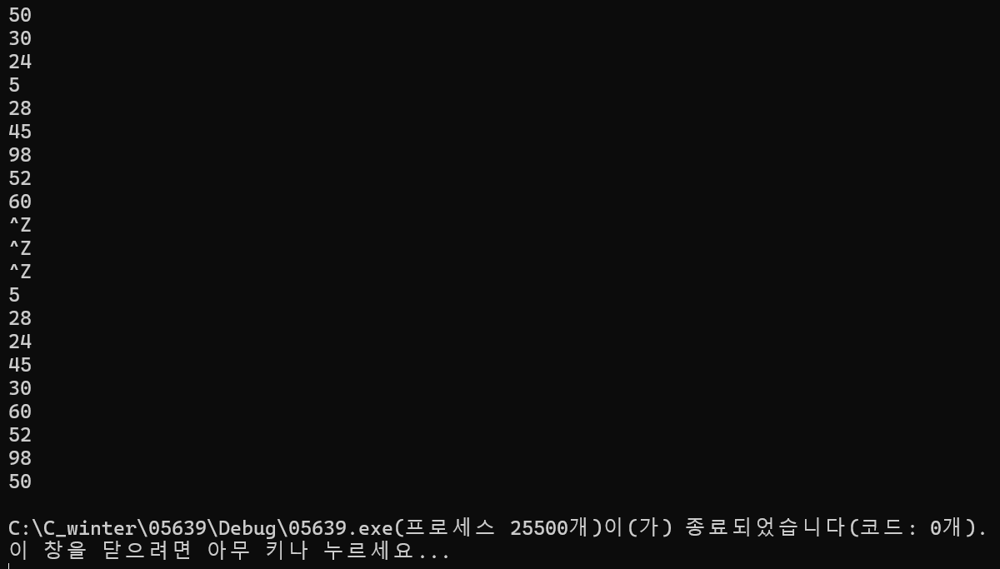
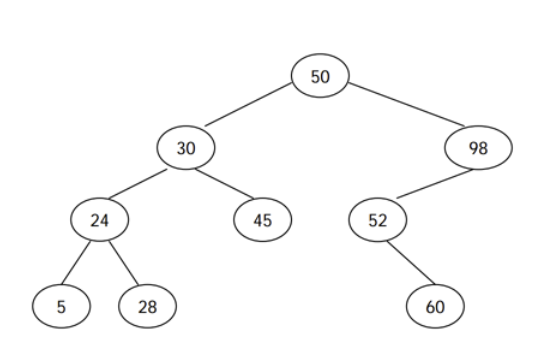

### 2024.04.03
### baekjoon 5639
# **Binary Search Tree**

## 1. Code
 ```c
#include <stdio.h>
#include <stdint.h>
#include <stdlib.h>

typedef struct Node
{
    int32_t data;
    struct Node *left;
    struct Node *right;
} node;

//@brief		insert node to make BST
node* 
BST_insert(node* root, int32_t x)
{
    // To avoid confusion in the name 'root', re-declare it as 'p'
    node* p = root;          
    node* parent = NULL;
    while (p != NULL) {
        parent = p;
        if (p -> data == x) {
            printf("같은 키 존재");
            return NULL;
        }
        else if (p -> data < x)
            p = p -> right;
        else
            p = p -> left;
    }
    // Allocate newnode
    node* newnode = (node *)malloc(sizeof(node));
    if (newnode == NULL) {
        printf("메모리 할당 오류\n");
        return NULL;
    }
    newnode->data = x;
    newnode->left = newnode->right = NULL;

    // Attach a new node as a parent's child
    if (parent != NULL) {
        if (parent -> data < newnode -> data)
            parent -> right = newnode;
        else
            parent -> left = newnode;   
    }
    return newnode;
}

//@brief		print nodes in post order
node* 
Postorder(node* root)
{
    if (root == NULL)
        return NULL;

    Postorder(root->left);
    Postorder(root->right);
    printf("%d\n", root->data); 
    
    return root;
}

int main()
{
    int32_t val;
    node* root = NULL;
    while (scanf("%d", &val) != EOF) {
        if (root == NULL) {
            root = BST_insert(root, val);
            if (root == NULL)
                break;
        } else {    
            BST_insert(root, val);
        }
    }
    Postorder(root);

    return 0;
}
 ```
***

## 2. output

***

## 3. Approach
### Pseudo code
```c
fuction BST_insert(node* cur, const int32_t num)
	if (cur == NULL) :
        allocate newnode;
		newnode->data = num;
		newnode->left = newnode->right = NULL;

	else {
		if (cur->data > num) :
			cur->left = insert(cur->left, num);
		
		else if (cur->data < num) :
			cur->right = insert(cur->right, num);
	}
```

### Explanation for Psuedo code
- If `cur` node is NULL, allocate newnode.   
- If `cur` node is not NULL, we have to swtich cursor.   
    - If data of `cur` node is bigger than `num`, cur = cur->left.   
    - Else if data of `cur` node is smaller than `num`, cur = cur->right.   

***

## 4. Analysis
### Correctness
   
If you create a tree normally in `BST_insert(...)`, you get this picture.    
If you output it in the post order, you get the correct result.   
Correct result is : $5->28->24->45->30->60->52->98->50$.

### Performance
- **Time complexity**   
time complexity is $O(n^2)$   
more accurately, it's $n^2 + 7n$.

- **About recursion**   
Although it is much more intuitive with recursive functions, it is not efficient in terms of memory or time complexity.   
The process of outputting to the postorder requires a recursive function.   
Therefore, the `BST_insert(...)` function saves time through iterations instead of recursive functions.   

***
